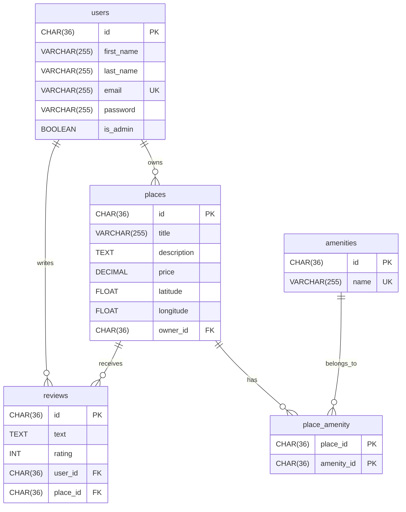

```mermaid
erDiagram
    users {
        CHAR(36) id PK
        VARCHAR(255) first_name
        VARCHAR(255) last_name
        VARCHAR(255) email UK
        VARCHAR(255) password
        BOOLEAN is_admin
    }
    
    places {
        CHAR(36) id PK
        VARCHAR(255) title
        TEXT description
        DECIMAL price
        FLOAT latitude
        FLOAT longitude
        CHAR(36) owner_id FK
    }
    
    reviews {
        CHAR(36) id PK
        TEXT text
        INT rating
        CHAR(36) user_id FK
        CHAR(36) place_id FK
    }
    
    amenities {
        CHAR(36) id PK
        VARCHAR(255) name UK
    }
    
    place_amenity {
        CHAR(36) place_id PK
        CHAR(36) amenity_id PK
    }
    
    users ||--o{ places : owns
    users ||--o{ reviews : writes
    places ||--o{ reviews : receives
    
    places ||--o{ place_amenity : has
    amenities ||--o{ place_amenity : belongs_to
```