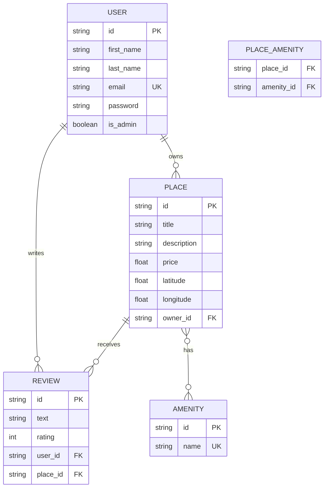

```markdown
# HBnB Evolution (Part 3) - Authentication & Database Integration


Welcome to Part 3 of the HBnB project! This phase marks a major evolution in the application's architecture. We have transitioned from a volatile, in-memory data storage system to a robust, persistent relational database using SQLAlchemy. Additionally, this phase introduces enterprise-grade security features including password hashing and JWT-based Authentication/Authorization.

---

## Key Features Introduced in Part 3

* **Relational Database Persistence:** Replaced the in-memory repository with SQLite (development) via SQLAlchemy ORM.
* **Secure Password Hashing:** User passwords are no longer stored in plain text. We utilize `Flask-Bcrypt` for secure, one-way password hashing.
* **JWT Authentication:** Implemented `Flask-JWT-Extended` to issue secure tokens upon login, creating a stateless and scalable authentication mechanism.
* **Role-Based Access Control (RBAC):** * **Public Access:** Can view places, reviews, and amenities.
  * **Authenticated Users:** Can create places, submit reviews (with strict ownership business logic), and edit their own profiles.
  * **Administrators:** Have elevated privileges to manage all users, create amenities, and bypass specific ownership restrictions.
* **Application Factory Pattern:** Refactored `create_app()` to support multiple configurations (Development, Testing, Production).

---

## Technology Stack

* **Framework:** Flask & Flask-RESTx
* **Database ORM:** SQLAlchemy & Flask-SQLAlchemy
* **Security & Auth:** Flask-Bcrypt, Flask-JWT-Extended
* **Database Engine:** SQLite (Dev/Test) / Raw SQL (`schema.sql`, `seed.sql`)
* **Architecture:** Facade Pattern & Repository Pattern

---

## Database Schema (Entity-Relationship Diagram)

Below is the schema representing the entities and their relationships. 



---

## Installation & Setup

### 1. Clone & Navigate

Navigate to the Part 3 directory of the project:

```bash
cd part3/hbnb

```

### 2. Virtual Environment Setup

It is highly recommended to use a virtual environment:

```bash
python3 -m venv venv
source venv/bin/activate  # On Windows use: venv\Scripts\activate

```

### 3. Install Dependencies

```bash
pip install -r requirements.txt

```

### 4. Database Initialization

Before running the application, generate the database tables and seed it with initial data (including an Admin user):

```bash
# Ensure the instance folder exists
mkdir -p instance

# Apply the schema and seed data
sqlite3 instance/development.db < schema.sql
sqlite3 instance/development.db < seed.sql

```

### 5. Run the Application

Start the development server:

```bash
python run.py

```

*The API will be available at `http://127.0.0.1:5000/api/v1/*`

---

## API Endpoints & Access Levels

### Authentication

| Method | Endpoint | Description | Access |
| --- | --- | --- | --- |
| **POST** | `/api/v1/auth/login` | Authenticate user & get JWT | Public |

### Users

| Method | Endpoint | Description | Access |
| --- | --- | --- | --- |
| **POST** | `/api/v1/users/` | Register a new user | Public (Admin for direct creation) |
| **GET** | `/api/v1/users/<id>` | Retrieve user details | Public |
| **PUT** | `/api/v1/users/<id>` | Update user profile | Authenticated (Self) / Admin |

### Places

| Method | Endpoint | Description | Access |
| --- | --- | --- | --- |
| **POST** | `/api/v1/places/` | Create a new place | Authenticated |
| **GET** | `/api/v1/places/` | Retrieve all places | Public |
| **PUT** | `/api/v1/places/<id>` | Modify a place | Authenticated (Owner) / Admin |

### Reviews

| Method | Endpoint | Description | Access |
| --- | --- | --- | --- |
| **POST** | `/api/v1/places/<id>/reviews` | Add a review to a place | Authenticated (Non-Owner) |
| **GET** | `/api/v1/places/<id>/reviews` | Get all reviews for a place | Public |
| **PUT** | `/api/v1/reviews/<id>` | Modify a review | Authenticated (Author) / Admin |

### Amenities

| Method | Endpoint | Description | Access |
| --- | --- | --- | --- |
| **POST** | `/api/v1/amenities/` | Create a new amenity | Admin Only |
| **GET** | `/api/v1/amenities/` | Retrieve all amenities | Public |
| **PUT** | `/api/v1/amenities/<id>` | Modify an amenity | Admin Only |

---

## Testing

To run the automated test suite for models and API endpoints:

```bash
pytest

```

*Tests cover model creation, JWT validation, repository operations, and RBAC endpoint protections.*

---

## Project Architecture Recap

This application adheres to a clean, multi-layered architecture:

* **Presentation Layer (API):** Flask-RESTx namespaces routing incoming HTTP requests and extracting JWT identities.
* **Business Logic Layer (Facade):** The `HBnBFacade` coordinates data flow, enforcing core business rules (e.g., preventing users from reviewing their own places).
* **Persistence Layer (Repository):** SQLAlchemy models (User, Place, Review, Amenity) interact with the database via dedicated repository classes (UserRepository, etc.), abstracting the SQL away from the business logic.

```

```